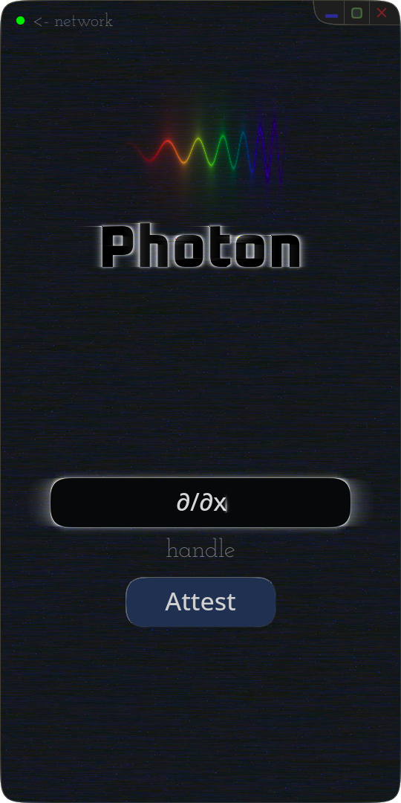

# Photon



**Decentralized messenger with passless authentication and rolling-chain encryption**

No servers. No passwords. No phone numbers. No corporate data harvesting.

---

## What This Is

Photon is a peer-to-peer messaging application that replaces traditional authentication (passwords, PINs, biometrics, recovery emails) with **social attestation**—your identity is verified by trusted humans, not by servers or credentials. Messages use **rolling-chain encryption**, where each message cryptographically depends on all previous messages, creating an immutable, tamper-evident communication history.

**Key Properties:**
- **A = 1**: Authentication happens once when you create your identity. All subsequent access uses cryptographic proofs from that single event.
- **True P2P**: No message servers. Peers connect directly after DHT-based discovery.
- **Hardware-bound identity**: Device keys derived deterministically from hardware fingerprints, never stored on disk.
- **Social recovery**: Lose your devices? Trusted contacts hold encrypted key shards for threshold reconstruction.
- **Message immutability**: Editing or deleting messages breaks cryptographic chain—tampering is detectable.

---

## Current Status

**Early Development** — Core infrastructure functional, messaging implementation in progress.

### What Works
- ✅ Cross-platform GUI (Windows, Linux, macOS, Android)
- ✅ Text input, selection, editing with cosmic-text rendering
- ✅ Window management and compositing pipeline
- ✅ Handle attestation with memory-hard proof-of-work (~1s computation)
- ✅ Peer discovery via FGTW DHT (handle → IP lookup)
- ✅ P2P status detection (online/offline via UDP ping/pong)
- ✅ NAT hole punching (broadcast ping to all peers on registration)
- ✅ Avatar upload/download to FGTW storage with rate limiting
- ✅ Contact storage (local encrypted + cloud backup to FGTW)
- ✅ Deterministic device identity (keys derived from hardware)
- ✅ CLUTCH key exchange (8-algorithm parallel ceremony with deterministic ceremony ID)
- ✅ Friendship-based chain encryption (256-link chains, 8KB per participant)
- ✅ LAN peer discovery (NAT hairpinning workaround via broadcast)
- ✅ Android build pipeline (tested on device)
- ✅ Signed binary distribution with self-verification

### What Doesn't Work Yet
- ⚠️ Encrypted message exchange (hash chains implemented, end-to-end testing in progress)
- ❌ Identity validation and key recovery flows
- ❌ Full social attestation (2-human requirement not enforced)

### Platform Support

| Platform | Status | Notes |
|----------|--------|-------|
| Linux | ✅ Working | X11/Wayland |
| Windows | ✅ Working | DirectDraw |
| macOS | ✅ Working | Intel + Apple Silicon |
| Android | ✅ Working | ARM64, tested on device |
| Redox | 🟡 Compiles | Orbital, untested |
| iOS | ❌ Blocked | See "Why No iOS?" below |

---

## Installation

### Quick Install (Recommended)

Download pre-built, cryptographically signed binaries:

**Linux/macOS/Redox:**
```bash
curl -sSfL https://holdmyoscilloscope.com/photon/install.sh | sh
```

**Windows (PowerShell):**
```powershell
iwr -useb https://holdmyoscilloscope.com/photon/install.ps1 | iex
```

The installer will:
0. Download a signed binary from holdmyoscilloscope.com
1. Install to `~/.local/bin` (Unix) or `%LOCALAPPDATA%\Programs\PhotonMessenger` (Windows)
2. Create desktop/Start Menu shortcut
3. Add binary to PATH

**Security**: Every binary is Ed25519-signed by Nick Spiker (fractaldecoder@proton.me) and self-verifies on startup. This protects against corruption and tampering. If verification fails, the binary won't run.

After installation, launch **Photon Messenger** from your application menu or run:
```bash
photon-messenger
```

### Building from Source

**⚠️ Warning**: Building from source requires generating your own signing keys. Use the installer unless you have specific reasons to build yourself.

If needed:
```bash
git clone https://github.com/nickspiker/photon
cd photon

# Generate signing keys (edit src/bin/photon-keygen.rs for key path)
cargo run --bin photon-keygen

# Update public key in src/self_verify.rs with your generated key

# Build and sign
cargo build --release
./sign-after-build.sh release
```

See [src/self_verify.rs](src/self_verify.rs) for complete signing documentation.

**Android:**
```bash
rustup target add aarch64-linux-android
cargo build --target aarch64-linux-android --release
./sign-after-build.sh release aarch64-linux-android
```

---

## How It Works

### Device Identity (Keys Derived From Hardware)

Photon derives device keys **deterministically from hardware identifiers**—keys are never stored on disk. Each launch, the app reads a platform-specific machine fingerprint and derives the Ed25519 keypair:

```rust
let fingerprint = get_machine_fingerprint();  // Platform-specific
let seed = blake3::hash(&fingerprint);        // 32-byte seed
let keypair = Ed25519::from_seed(&seed);      // Deterministic
```

**Platform fingerprint sources:**

| Platform | Source | Stability |
|----------|--------|-----------|
| Linux | `/etc/machine-id` | Survives reboots, unique per install |
| Windows | Registry `MachineGuid` | Survives reboots, unique per install |
| macOS | `IOPlatformUUID` | Hardware-burned, survives reinstalls |
| Android | `ANDROID_ID` + user number | Per-device, per-signing-key |
| Redox | `/etc/hostid` or hostname | Fallback path |

**Why derived keys?**

Stored keys can be copied to another device (identity theft), extracted by malware, or found in forensic analysis. Derived keys tie identity to physical hardware—the device IS the identity.

#### Hardware Security Reality

Modern devices contain dedicated security chips capable of unforgeable cryptographic proofs:

- **Android**: StrongBox/TEE secure processors
- **iOS/macOS**: Secure Enclave (T2/Apple Silicon)
- **Windows/Linux**: TPM 2.0

These chips can perform **cryptographic oracles**—signing data with hardware-bound keys that never leave the chip. This would provide stronger guarantees: attacker can't forge signatures without physical chip access, software compromise doesn't leak secrets, device identity persists across OS reinstalls.

**Why Photon doesn't use hardware security:**

Platform vendors reserve these features for internal services and don't expose them to third-party applications:

| Platform | Hardware | Third-Party Access | Limitation |
|----------|----------|-------------------|------------|
| Android | ✅ StrongBox/TEE | ✅ Partial | `ANDROID_ID` is 64-bit oracle output |
| iOS/macOS | ✅ Secure Enclave | ❌ Internal only | Reserved for Apple services |
| Windows | ✅ TPM 2.0 | ⚠️ Complex | Inconsistent availability, no standard API |
| Linux | ✅ TPM 2.0 | ⚠️ Manual | Requires manual setup, arcane tools |

Android's `ANDROID_ID` is effectively `HMAC(device_secret, signing_key)` with 64-bit output—better than readable identifiers but not full hardware oracle access. Other platforms provide readable identifiers (machine-id, IOPlatformUUID) that are unique and persistent but not cryptographically secret.

**Photon's approach:**

Given platform limitations, Photon derives app-specific secrets from readable identifiers:

```rust
const APP_CONTEXT: &[u8] = b"photon_device_identity_v0";
let device_secret = blake3::derive_key(APP_CONTEXT, &machine_id);
```

This provides: device-specific keys, resistance to remote attacks (requires both identifier exfiltration and app reverse-engineering), and security comparable to SSH keys or cryptocurrency wallets. Physical device theft remains the primary threat vector.

The hardware exists and is capable. Platform vendors use it internally for device attestation, DRM, and payment processing. Third-party access would enable applications that bypass platform identity systems—a business model conflict, not a technical limitation.

---

### Rolling-Chain Encryption

Traditional messaging (Signal, WhatsApp) uses **Double Ratchet**: sender advances keys immediately, receiver stores "skipped message keys" for out-of-order delivery. This enables asynchronous messaging but makes ordering non-deterministic.

Photon uses **rolling-chain encryption**: the sender does not advance chain state until receiving confirmation that the message was successfully received and decrypted. This creates a synchronization loop:

```
Alice (state₀)  ──message encrypted with state₀──→  Bob (state₀)
                                                      Bob decrypts, advances to state₁
Alice (state₀)  ←──────ACK or reply──────────────  Bob (state₁)
Alice advances to state₁
[Both now at state₁, loop complete]
```

**Properties enabled by acknowledgment-based advancement:**

0. **Prevents desynchronization**: Lost messages leave both parties at same state—no "skipped keys"
1. **Enforces ordering**: Messages processed sequentially with verified sequence numbers
2. **Enables immutability**: Deleting or editing message breaks all subsequent hashes—cryptographic proof of tampering
3. **Simplifies recovery**: New devices replay message history from checkpoints without complex key management

**How the chain works:**

Each participant has a 256-link chain (8KB) derived from CLUTCH shared secrets. The chain uses rolling rotation to achieve BLAKE3 avalanche optimization:

```rust
/// 256-link chain (8KB) - one per participant
pub struct Chain {
    links: [[u8; 32]; 256],
}

impl Chain {
    /// Current encryption key is always link[0]
    pub fn current_key(&self) -> &[u8; 32] {
        &self.links[0]
    }

    /// Advance chain after ACK: rotate all links, derive new link[0]
    pub fn advance(&mut self, plaintext_hash: &[u8; 32]) {
        let old_top = self.links[0];
        // Rotate all links down (forces full 8KB through BLAKE3)
        for i in (1..256).rev() {
            self.links[i] = self.links[i - 1];
        }
        // New link[0] = BLAKE3(old_top || plaintext_hash || full_chain)
        let mut hasher = blake3::Hasher::new();
        hasher.update(&old_top);
        hasher.update(plaintext_hash);
        hasher.update(self.links.as_flattened()); // Full 8KB avalanche
        self.links[0] = *hasher.finalize().as_bytes();
    }
}
```

**Why 256 links?** Fits in L1 cache (8KB), provides reasonable recovery window, and the rotation forces full avalanche on every advance. Each participant only advances their own chain—no race conditions in N-party conversations.

Breaking one message doesn't reveal others (forward secrecy via BLAKE3 preimage resistance). Modifying message `i` changes all subsequent states—tampering is cryptographically detectable.

**Encryption layer:**

The chain state XOR is not the only encryption. Final messages use **ChaCha20-Poly1305 AEAD**:

```rust
encryption_key = BLAKE3_KDF(chain_state, "photon.encryption.v1")
encrypted_message = ChaCha20Poly1305::encrypt(key, nonce, plaintext)
```
Rolling-chain provides immutability and ordering; ChaCha20-Poly1305 provides standard cryptographic security.

**Latency characteristics:**

This synchronization model doesn't compromise performance. Direct peer-to-peer connections have significantly lower latency than server-relayed messaging:

| Path | Round-trip Latency |
|------|-------------------|
| Photon P2P (Seattle–Los Angeles) | ~25-30ms |
| Photon P2P (Los Angeles–New York) | ~50-60ms |
| Signal/WhatsApp | 100-300ms (server relay) |
| Zoom | 100-300ms (central server) |
| FaceTime | 80-200ms (Apple relay) |

For regional connections (Seattle–LA), video frames arrive **before the next frame starts capturing** at 30fps (33.33ms per frame). Acknowledgments return faster than human perception can register. Even coast-to-coast (LA–NYC), Photon is **3-6x faster** than commercial services while providing cryptographic immutability and no corporate surveillance.

**Trade-offs:**

| Double Ratchet (Signal) | Rolling-Chain (Photon) |
|------------------------|------------------------|
| Async: sender advances immediately | Sync: sender waits for ACK |
| Out-of-order delivery supported | Sequential processing enforced |
| Skipped message keys stored | No skipped keys |
| Message deletion undetectable | Deletion breaks chain (detectable) |
| Message editing undetectable | Editing breaks chain (detectable) |

---

### Passless Authentication

**Authentication Count: A = 1**

You authenticate once when creating your identity. All subsequent access uses cryptographic proofs derived from that single authentication event.

**Identity recovery mechanisms:**

0. **Proximity transfer**: Authorized device transfers identity to new device via Bluetooth LE with 3-word visual verification (manual entry if BLE unavailable or out of range)

1. **Social recovery**: Lose all devices? Trusted contacts hold encrypted shards of your private key. Threshold reconstruction typically requires 5 friends—your security boundary is the number of trusted contacts who would need to collude to compromise your identity.

**Handle attestation:**

Identity is tied to your handle—any Unicode string of any length (e.g., `fractal decoder`, `🚀`, `∫∂x`, or `☢⚡☃`). The handle is hashed with BLAKE3 to derive a network address. Claiming a handle requires **two human attestations**—existing users vouch for your identity. This is invite-only by design.

**Attestation flow** (see [AUTH.md](AUTH.md) for full specification):

0. User requests handle (e.g., `Wayne`)
1. System queries DHT: is `Wayne` already claimed?
2. If unclaimed, user requests attestations from 2 trusted people
3. Attesters see: device type, approximate location, timestamp
4. Attesters verify out-of-band (phone call, video, in-person)
5. Both attestations required within 24 hours
6. Handle cryptographically bound to user's public key

**Why attestation?**

Traditional authentication asks "prove you are you" then accepts a password—which proves nothing about identity, only knowledge of a secret. It doesn't even prove you're human. Password reset flows are worse: anyone with access to your email or phone can claim your account.

Photon uses the security model humans have used for millennia: trusted relationships. Your friends vouch for you, hold shards of your identity, and verify recovery requests. No company, no customer support, no "click this link to reset."

See [AUTH.md](AUTH.md) for detailed specification.

---

### Network Architecture

**Peer discovery:** FGTW (Fractal Gradient Trust Web)—custom Kademlia DHT with 32-byte BLAKE3 node IDs, 256 k-buckets, and VSF-serialized protocol messages. Handle lookups: `BLAKE3(handle) → handle_hash → Kademlia routing → peer records`. Bootstrap via `fgtw.org/peers.vsf` (Cloudflare Workers endpoint providing seed routing table population).

**Transport:** UDP for P2P status and messaging, HTTPS (rustls) for bootstrap fetches. WebSocket support planned for NAT traversal.

**Message routing (planned):**
- Direct UDP when both peers online
- Store-and-forward via trusted contacts when recipient offline
- No central relay servers

**Storage model:** Messages persist as long as you want them to, distributed across devices you control and friends who've agreed to store encrypted backups. The bootstrap endpoint (`fgtw.org`) only provides initial peer discovery—after that, the DHT is self-sustaining. No central servers store or process messages.

---

## Architecture

### Module Structure

```
src/
├── main.rs              - Winit event loop, window management
├── lib.rs               - Module exports, debug utilities
├── self_verify.rs       - Ed25519 binary signature verification
├── crypto/
│   ├── chain.rs         - 256-link rolling chains (8KB per participant)
│   ├── clutch.rs        - 8-algorithm parallel key ceremony
│   ├── handle_proof.rs  - Memory-hard handle attestation (~1s)
│   ├── keys.rs          - Identity key management (TODO)
│   └── shards.rs        - Social recovery key sharding (TODO)
├── network/
│   ├── fgtw/
│   │   ├── identity.rs  - Deterministic key derivation
│   │   ├── protocol.rs  - VSF-encoded FGTW + CLUTCH messages
│   │   ├── node.rs      - Kademlia DHT routing
│   │   ├── peer_store.rs - Peer caching
│   │   └── bootstrap.rs - Initial peer discovery
│   ├── pt/              - PT (Photon Transfer) large message transport
│   ├── handle_query.rs  - Handle attestation and lookup
│   ├── status.rs        - P2P ping/pong, CLUTCH ceremony orchestration
│   ├── udp.rs           - UDP socket utilities
│   └── tcp.rs           - TCP fallback for large payloads
├── ui/
│   ├── app.rs           - Application state machine
│   ├── avatar.rs        - Avatar encoding/upload/download
│   ├── text_rasterizing.rs - Font rendering (cosmic-text)
│   ├── renderer_*.rs    - Platform-specific rendering
│   ├── keyboard.rs      - Input handling
│   ├── text_editing.rs  - Text input state
│   └── theme.rs         - Color palette
├── types/
│   ├── contact.rs       - Contact info, CLUTCH state, trust levels
│   ├── friendship.rs    - FriendshipId, CeremonyId, FriendshipChains
│   ├── message.rs       - Message structure, status, expiration
│   └── shard.rs         - Key shard structures
└── storage/
    ├── contacts.rs      - Local encrypted contact storage
    ├── friendship.rs    - Per-friendship chain persistence
    └── cloud.rs         - FGTW cloud backup (contacts sync)
```

### Implementation Status

| Component | Status | Notes |
|-----------|--------|-------|
| UI Framework | ✅ Complete | Custom winit-based GUI, differential rendering |
| Text Rendering | ✅ Complete | cosmic-text, selection, editing |
| Device Identity | ✅ Complete | Deterministic keys from hardware (never stored) |
| Crypto Types | ✅ Complete | Identity, seed, shard, message structures |
| CLUTCH Key Exchange | ✅ Working | 8-algorithm ceremony, deterministic ceremony_id |
| Friendship Chains | ✅ Working | 256-link chains (8KB), per-participant advancement |
| Handle Attestation | ✅ Working | Memory-hard PoW (~1s), DHT storage |
| Peer Discovery | ✅ Working | FGTW DHT + LAN broadcast (hairpin NAT workaround) |
| P2P Status | ✅ Working | UDP ping/pong with Ed25519 signatures, hysteresis |
| Avatar System | ✅ Working | VSF-encoded, FGTW storage, rate-limited uploads |
| Contact Storage | ✅ Working | Local encrypted + cloud backup to FGTW |
| Binary Signing | ✅ Working | Ed25519 signatures, self-verification on startup |
| Network Transport | ✅ Working | UDP + TCP fallback + PT for large payloads |
| Message Persistence | ❌ Empty | VSF storage layer not implemented |
| Social Recovery | ❌ Stubbed | Shard distribution/reconstruction TODO |
| Peer Messaging | ⚠️ Partial | Chains derived, encrypted message flow pending |

### Technology Stack

**Core:**
- `winit` - Cross-platform windowing
- `softbuffer` - Software rendering
- `cosmic-text` - Font rendering and text layout
- `arboard` - Clipboard access

**Crypto:**
- `blake3` - Cryptographic hashing (chain state, KDF)
- `chacha20poly1305` - AEAD encryption
- `x25519-dalek` - Elliptic curve Diffie-Hellman
- `zeroize` - Secure memory wiping

**Network:**
- `tokio` - Async runtime
- `tokio-tungstenite` - WebSocket (planned for NAT traversal)
- `reqwest` - HTTP client with rustls (bootstrap fetches)

**Storage:**
- `vsf` - Versatile Storage Format (self-describing binary with embedded schemas, versioning, and per-record cryptographic signatures)
- `bincode` - Binary serialization

---

## File Format: VSF (Versatile Storage Format)

Messages and identity data use VSF—a self-describing binary format with cryptographic integrity. Implementation is functional but needs updates for messaging.

**VSF provides:**
- Type-length-value encoding
- Embedded schemas with version information
- Forward compatibility
- Per-record cryptographic signatures
- Optional compression

See `tools/` directory for VSF utilities (format inspection, validation).

---

## Distribution Philosophy

We do not distribute via Google Play Store, Apple App Store, or Microsoft Store. These platforms create barriers incompatible with our security model and decentralized architecture. Ready-to-run signed binaries are provided in `bin/`.

**Reasons for direct distribution:**

0. **Encryption reporting requirements**: US Export Administration Regulations require registration with the Bureau of Industry and Security and disclosure of encryption implementation details before international distribution.

1. **Review process uncertainty**: App stores can reject applications with strong encryption or demand explanations of security implementations.

2. **Corporate intermediaries**: Distribution thru stores requires trusting corporations to maintain access to software.

3. **Sideloading restrictions**: iOS requires annual re-signing ($99/year developer account), free accounts must reinstall every 7 days. Android allows direct APK installation but shows discouragement warnings.

We provide cryptographically signed binaries with published checksums. Users verify signatures, verify source, and run directly.

---

## Why No iOS?

Apple's iOS platform has architectural incompatibilities with Photon's design:

**Distribution barriers:**
- App Store requires $99/year developer account tied to real identity
- All binaries must be Apple-signed
- Sideloading requires re-installation every 7 days (free accounts) or yearly (paid)
- Enterprise distribution violates terms if used publicly
- No mechanism for "public infrastructure without corporate owner"

**Technical limitations:**
- **No raw socket access**: Cannot connect to DHT peers directly
- **No background processes**: Apps terminated after ~30 seconds in background
- **Sandbox restrictions**: Cannot run persistent TOKEN daemon
- **Entitlement gatekeeping**: Network access requires Apple approval
- **No system-level services**: Architecture assumes apps are foreground-only

Photon requires persistent background connections, direct peer-to-peer networking, and system-level cryptographic services. iOS prohibits all of these by design, not by technical limitation.

The EU's Digital Markets Act may force sideloading in Europe by 2026, but likely won't address the fundamental architectural restrictions.

---

## Comparison with Existing Messengers

| Property | Signal | WhatsApp | Matrix | Photon |
|----------|--------|----------|--------|--------|
| Architecture | Centralized | Centralized | Federated | P2P |
| Authentication count | Multiple | Multiple | Multiple | **1** |
| Social recovery | No | No | No | **Yes** |
| Metadata privacy | Partial | No | Partial | **Yes** |
| Self-sovereign data | No | No | Partial | **Yes** |
| Message immutability | No | No | No | **Yes** |
| Phone number required | Yes | Yes | No | No |
| Single point of failure | Yes | Yes | Partial | No |

**Architecture implications:**

- **Centralized** (Signal, WhatsApp): Single company runs servers. Can be subpoenaed, shut down, or pressured by governments.
- **Federated** (Matrix): Multiple servers run by different operators. Better than centralized but still relies on homeservers—messages flow thru infrastructure users don't control.
- **P2P** (Photon): No message servers. Peers connect directly. DHT bootstrap only provides initial peer discovery—after that, the network is self-sustaining.

**Signal/WhatsApp:**
- Centralized servers (legal vulnerability)
- Phone number required (ties identity to carrier)
- No social recovery (lose device → lose account)
- Message deletion undetectable by recipient

**Matrix:**
- Federation, not P2P (homeserver dependency)
- Authentication per device/homeserver
- No social key recovery
- Metadata visible to homeserver operators
- Homeservers can be individually shut down

**Photon:**
- True P2P (no message servers)
- Single authentication event (A = 1)
- Social recovery (threshold reconstruction)
- Message immutability (tampering detectable)
- Metadata privacy (traffic appears as HTTPS)

---

## Security Properties

**Guaranteed by rolling-chain encryption:**

0. Forward secrecy (compromising state_n doesn't reveal state_n-1)
1. Replay resistance (sequence numbers prevent replayed messages)
2. Reorder detection (out-of-order messages fail sequence validation)
3. Tamper evidence (modifying message breaks all subsequent hashes)
4. Message immutability (deletion/editing cryptographically detectable)

**Guaranteed by attestation system:**

0. Human identity verification (automated systems can't pass two attestations)
1. Rate limiting (1 attestation request per hour per device)
2. Collusion visibility (both attesters see each other's approval)
3. Reputation staking (attesters risk reputation vouching for abusers)

**Not protected against:**

- Physical device theft (if device unlocked)
- Threshold collusion (k or more trusted contacts)
- Screenshots or physical photography of screen
- Quantum computers breaking X25519 (future threat—would require protocol upgrade)

---

## Design Philosophy

From [AGENT.md](https://github.com/nickspiker/photon/blob/main/AGENT.md):

0. **Trust the math**: If loop bounds guarantee safety, don't add runtime checks
1. **Fail fast, fail loud**: Panics expose bugs; bounds checks can hide them
2. **No fixed pixels**: Everything scales relative to screen dimensions
3. **Explicit over "safe"**: Direct indexing when mathematically proven safe

See [AGENT.md](AGENT.md) for complete code generation rules.

---

## Contributing

Photon is in early development. Contributions welcome—please read architecture documentation first:

- [AUTH.md](AUTH.md) - Attestation system specification (1,350 lines)
- [AGENT.md](AGENT.md) - Code generation rules
- This README - Architecture and current status

**High-priority areas:**

0. Network transport (direct peer connections, WebSocket)
1. Message persistence (VSF storage layer)
2. Social recovery (shard distribution, threshold reconstruction)
3. Android testing (real-device validation)
4. ChaCha20-Poly1305 integration (complete rolling-chain implementation)

**Testing:**
```bash
cargo test
cargo bench  # Crypto benchmarks
```

Test coverage is currently minimal—this is early-stage development. Write tests for any new cryptographic code.

---

## Related Projects

Photon is the first implementation of **TOKEN**—a universal digital identity system where authentication happens once (A = 1). Planned TOKEN applications:

- `ferros` - Kill-switch ready OS
- Additional applications TBD

Once authenticated with TOKEN, all applications use that single identity. Install TOKEN on new device → everything appears automatically (apps, settings, messages, contacts, files). No passwords, no setup wizards, no per-app logins.

Photon demonstrates the social attestation and recovery model works before applying it to higher-stakes use cases (property deeds, medical records, financial assets).

---

## License

MIT OR Apache-2.0 (dual-licensed)

See [LICENSE-MIT](LICENSE-MIT) and [LICENSE-APACHE](LICENSE-APACHE)

---

## Contact

**Nick Spiker** - fractaldecoder@proton.me

---

**Project Status:** 🟡 Early Development (GUI functional, P2P status working, messaging pending)

**Platform Support:** Linux ✅ | Windows ✅ | macOS ✅ | Android ✅ | Redox 🟡 | iOS ❌

**Last Updated:** 2025-12-10