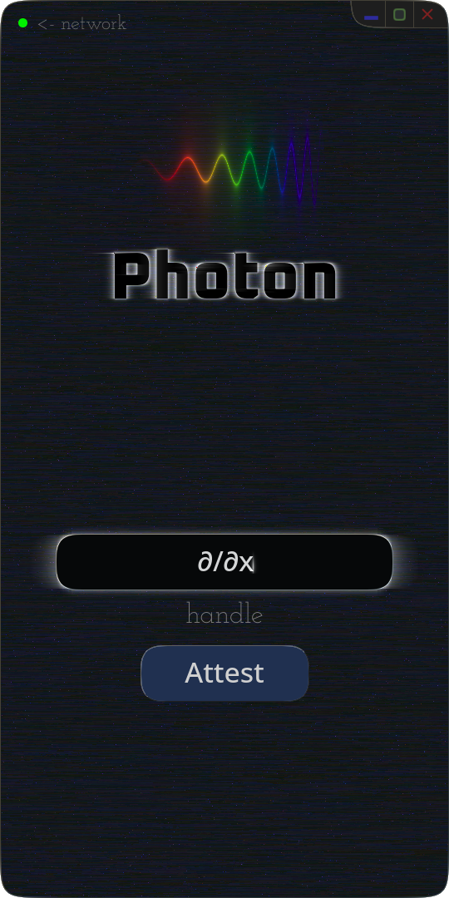

# Photon



**A messenger where your identity is yours — not a row in someone's database.**

No servers holding your account. No passwords to steal. No phone numbers, no SIM, no carrier. No company that can lock you out, hand you over, or shut you down.

---

## The idea in one breath

In every system you use today, someone else owns your identity. The bank, the platform, the carrier, the "sign in with…" button — each of them holds the key that actually *is* you, and you hold a contract that lets you ask them to act on your behalf. A contract can be revoked, subpoenaed, sold, or breached. In cryptography, whoever holds the private key **is** the owner; everyone else is a tenant.

Photon gives you the key.

Your identity is a **handle** you choose — any text at all: `purple octopus`, `∫∂x`, `ℕƐρ⊤∪ηǝ`, `slow tide`. From that handle, and from a secret burned into each of your devices, your identity is derived by math. No authority issues it. No authority can withdraw it. A service either can verify you or it can't — there's no account for anyone to freeze.

This buys you three things:

- **One identity.** Chosen once, for life. It works on every device, every network, everywhere — no re-registration, ever.
- **One action to move.** Pick up a new device, confirm once, and your whole world is there — every conversation, every contact, immediately. No re-login, no per-app setup.
- **No one in the middle.** No password to phish, no SIM to swap, no support line to social-engineer, no central store to breach. There is simply nothing of yours sitting in someone else's vault to take.

The full design — credential ownership, threshold recovery, billing you alone can authorize, physics-anchored time — is written up as the **TOKEN** patent family (part of a stack with **PIPE** hardware, **ISOMEM** memory isolation, and **SPIRIX** deterministic arithmetic). Photon is the messenger built on it: the first working piece.

---

## Read this before you start — four things that matter

Photon hands you real ownership, and ownership means the responsibility comes with it. Four things are worth understanding up front. None is hard; all four save you grief.

### 1. Choose your handle with care

Your handle **is** your identity — the root everything else grows from. It's the thing you hand to people out of band (say it out loud, write it on paper) so they can reach you.

- **It is not a username and not your name.** Don't use your legal name or an email address. A handle like `paper kite` or `slow tide` is distinctive, memorable, and doesn't collide with everyone who shares your first name.
- **Anything routes.** Because the network only ever sees a *hash* of your handle, the handle itself can be any Unicode at all — spaces, emoji, math, any script. `omega cyan` and `omega_cyan` are entirely different handles, so use the real space you'd actually say.
- **Case and spacing matter.** `omega cyan`, `Omega cyan`, and `Omega Cyan` are three different identities. Lowercase with real spaces is easiest to dictate.
- **First to claim it, owns it.** Claiming is deliberately cheap once and expensive in bulk (a ~1-second proof-of-work rations it), so squatting a namespace is uneconomic — but if two people pick the same handle, the first to finish claiming keeps it. Pick something distinctive.
- **Disclosing your handle is safe.** Unlike a password, you *can* hand your handle to people. Knowing it lets no one act as you and — because reaching you requires *both* sides to add each other — it doesn't even let someone contact you unless you add them back. There's no directory and no unilateral "just message this handle." Contact is always two-sided and consented.

Your handle names you; it never authorizes anyone. Acting as you additionally requires one of *your* devices. That's what the next three points are about.

### 2. Never be down to your last device — and don't lose it

Your identity lives across the devices you've added to it. Any one of them is fully you; losing one is losing *a device*, not your identity — the others carry on untouched, and you revoke the lost one remotely.

The danger is being down to **one** device and losing *it*. Today, if that last device is gone and you haven't set up recovery, your identity is gone with it — there's no company to call, which is the whole point, but it also means **there's no company to call.** So:

- **Add a second device the day you start** (next point). Two is the floor; more is better.
- **Recovery through people is coming** (point 4) — trusted friends who can vouch you back onto a fresh device after *total* loss. Until that's fully wired, treat your devices as the only copies of your identity, because they are.

A wiped device (factory reset, reinstall) is a special case: it keeps the one secret that proves it's yours, so it can rejoin your fleet without recovery — *as long as the app's signing key hasn't changed under it.* (If you reinstall from a differently-signed build, the OS hands the app a new hardware fingerprint and the device reads as new. Re-add it like any new device.)

### 3. Add several devices — it's one tap

Adding a device is a single deliberate act, and it needs no carrier, no store, no account, no cloud:

- **In person:** hold an existing device near the new one and confirm on the old one. Done.
- **Apart:** the new device shows a short pairing phrase; type it into a device you already own, which signs the newcomer into your fleet.

The moment it's in, the new device *is* you — every conversation and contact already present, nothing to re-enter. One identity can be live on your watch, phone, laptop, and car at once; each device speaks as you, and you can revoke any of them from any other.

Spread across a few devices, you're resilient by default: lose one, you've lost nothing that matters.

*(Coming: an NFC tap to add a device — hold them together, tap, and the same ceremony runs underneath, the tap carrying only a public key. Physical invite cards that carry a handle are on the same track.)*

### 4. Recovery is people, not passwords

When recovery lands, this is how a *total* loss (every device gone) comes back: you choose a handful of trusted people — **custodians** — ahead of time. To come back you re-enter your handle on a new device, and a threshold of them recognize you (your face, your voice, a shared history) and each approve. No company, no reset link, no security questions.

The design requires **at least three** custodians and a threshold of at least three, so no single person — and no pair — can ever reconstitute you against your will, and you pick more than the threshold so ordinary life (a friend loses *their* phone, moves, drifts) never locks you out. Choose people who know you and whom you'd trust with this. Set them up early.

> **Status:** device fleet (add/remove/rejoin) and encrypted messaging are working today. Full people-based recovery is designed and in progress — see [What Works](#current-status) below. Until it's complete, **your devices are your only backup.** Add more than one.

---

## What This Is, precisely

Photon is a peer-to-peer messenger. Your identity is a handle you own, derived from your own entropy and never issued by anyone. Messages use **rolling-chain encryption** — each message cryptographically depends on the last, so the history is tamper-evident and forward-secret. There are no message servers: peers find each other through a distributed hash table and then talk directly.

**Key properties:**
- **Authenticate once.** You prove who you are a single time, when you create your identity. Everything after is *verification* — cheap, repeated confirmation that a signature came from the same key — not a fresh login. There's no session to expire and re-establish.
- **You hold the key.** Your private credential never leaves your devices in any form that can be read, copied, or exported. Services hold only your public key, which is safe by definition. A breach of any service exposes nothing of yours.
- **Device-bound.** Acting as you requires one of your devices, whose secret is derived from a hardware identifier and never stored on disk. On commodity hardware that identifier is written by the OS vendor and, on desktop, readable by local code — so today this binds against *remote* attackers, not a true hardware secret. See [what this actually protects](#what-this-actually-protects-and-what-it-does-not-read-before-shipping-on-commodity-hardware). Dedicated **PIPE** silicon is the endgame that makes it a real hardware lock.
- **Contact is mutual.** No directory, no unilateral reachability. Two people can reach each other only after each adds the other — being contactable is itself a consented, two-sided relationship.
- **Recovery is human.** Lose everything and trusted people — not a company — vouch you back. (In progress.)

---

## Current Status

**🟢 Mainnet is live.** The network is open and permissionless — [install](#installation), pick a handle, and you're on. No invite, no waitlist, no approval. It's early and rough in places (see below), but it's real and running.

### What Works
- ✅ Cross-platform GUI (Windows, Linux, macOS, Android)
- ✅ Text input, selection, editing with cosmic-text rendering
- ✅ Window management and compositing pipeline
- ✅ Handle attestation with memory-hard proof-of-work (~1s computation)
- ✅ Peer discovery via FGTW DHT (handle → IP lookup)
- ✅ P2P status detection (online/offline via UDP ping/pong)
- ✅ NAT hole punching (broadcast ping to all peers on registration)
- ✅ Avatar upload/download to FGTW storage with rate limiting
- ✅ Contact storage (local encrypted + cloud backup to FGTW)
- ✅ Deterministic device identity (keys derived from hardware)
- ✅ CLUTCH key exchange (8-algorithm parallel ceremony across four mathematical families, quantum-resistant by construction)
- ✅ Rolling-chain encryption (256-link chains, forward-secret, tamper-evident)
- ✅ Encrypted P2P messaging over the chain, verified device-to-device
- ✅ Multi-device fleet: add a device (near-tap or pairing phrase), remove/revoke, and rejoin after a wipe via the surviving device secret
- ✅ Fleet sync: contacts and settings converge across your devices under the fleet key
- ✅ LAN peer discovery (NAT hairpinning workaround via broadcast)
- ✅ Android build pipeline (tested on device)
- ✅ Signed binary distribution with self-verification

### What Doesn't Work Yet
- ⚠️ Custodian recovery (all-devices-lost): threshold reconstruction is designed and partially built — **not yet a backstop you can rely on.** Keep more than one device.
- ⚠️ NFC device-add and physical invite cards (designed; typing/near-tap is the path today)
- ⚠️ The wider TOKEN surface — billing you alone authorize, portable reputation, physics-anchored time — is specified in the patent and not yet in Photon

### Platform Support

| Platform | Status | Notes |
|----------|--------|-------|
| Linux x86_64 | ✅ Working | wgpu/Vulkan, X11/Wayland |
| Linux ARM64 | ✅ Working | wgpu/Vulkan (Asahi etc.) |
| Windows | ✅ Working | GDI |
| macOS Intel | ✅ Working | wgpu/Metal |
| macOS Apple Silicon | ✅ Working | wgpu/Metal |
| Android | ✅ Working | ARM64, tested on device |
| Redox | 🟡 Compiles | Orbital, untested |
| iOS | ❌ Blocked | See "Why No iOS?" below |
| ferros | ✅ Future | waiting on ferros components |

---

## Installation

The one-line installer downloads a pre-built, cryptographically signed binary and creates shortcuts.
These commands mirror the ones on [holdmyoscilloscope.com/photon](https://holdmyoscilloscope.com/photon) exactly.
If that site is ever down, use the **GitHub fallback** commands further down — they pull the identical signed binaries straight from this repo's Releases, so this page is a complete standalone install source.

### Release (Recommended)

**Linux/macOS/Redox:**
```bash
curl -sSfL https://brobdingnagian.holdmyoscilloscope.com/photon/install-release.sh | sh
```

**Windows (PowerShell):**
```powershell
powershell -ExecutionPolicy Bypass -c "irm https://brobdingnagian.holdmyoscilloscope.com/photon/install-release.ps1 | iex"
```

**Android:** [Download APK](https://brobdingnagian.holdmyoscilloscope.com/photon/photon-messenger-android-release.apk) — enable "Install unknown apps" in Settings if prompted.

### Development

Pre-release builds for testing, visually tagged so they're never mistaken for release.

**Linux/macOS/Redox:**
```bash
curl -sSfL https://brobdingnagian.holdmyoscilloscope.com/photon/install-development.sh | sh
```

**Windows (PowerShell):**
```powershell
powershell -ExecutionPolicy Bypass -c "irm https://brobdingnagian.holdmyoscilloscope.com/photon/install-development.ps1 | iex"
```

**Android:** [Download APK](https://brobdingnagian.holdmyoscilloscope.com/photon/photon-messenger-android-development.apk)

After install, find **Photon Messenger** in your program list (Start Menu on Windows, app launcher on Linux), or run `photon-messenger` from a terminal.

### GitHub fallback (if holdmyoscilloscope.com is down)

The same signed binaries are mirrored to this repo's [Releases](https://github.com/nickspiker/photon/releases).
Every binary self-verifies its Ed25519 signature on launch regardless of where it was downloaded, so a GitHub-served binary is exactly as trustworthy as one from the primary site.

**Release** binaries live on the immutable `v<n>` tag — grab the [latest release](https://github.com/nickspiker/photon/releases/latest) and download the asset for your platform:

| Platform | Processor | Asset |
|----------|-----------|-------|
| Linux | x86_64 | `photon-messenger-linux-x86_64-release` |
| Linux | ARM64 (aarch64) | `photon-messenger-linux-arm64-release` |
| Windows | x86_64 | `photon-messenger-windows-release.exe` |
| macOS Intel | x86_64 | `photon-messenger-macos-intel-release` |
| macOS Apple Silicon | ARM64 (aarch64) | `photon-messenger-macos-arm64-release` |
| Redox | x86_64 | `photon-messenger-redox-release` |
| Android | ARM64 (aarch64) | `photon-messenger-android-release.apk` |

Then mark it executable and run it (it verifies itself on first launch):
```bash
# Linux x86_64 example — swap the asset name for your platform
curl -sSfL -o photon-messenger \
  "$(curl -sSfL https://api.github.com/repos/nickspiker/photon/releases/latest \
     | jq -r '.assets[] | select(.name=="photon-messenger-linux-x86_64-release") | .browser_download_url')"
chmod +x photon-messenger
./photon-messenger
```

**Development** binaries are content-addressed (`...-development-<hash>`) on the rolling [`dev`](https://github.com/nickspiker/photon/releases/tag/dev) prerelease, so every build has a fresh URL that can never be served stale. Resolve the newest one for your platform via the API, using the base name for your platform:

| Platform | Processor | Base name |
|----------|-----------|-----------|
| Linux | x86_64 | `photon-messenger-linux-x86_64-development` |
| Linux | ARM64 (aarch64) | `photon-messenger-linux-arm64-development` |
| Windows | x86_64 | `photon-messenger-windows-development.exe` |
| macOS Intel | x86_64 | `photon-messenger-macos-intel-development` |
| macOS Apple Silicon | ARM64 (aarch64) | `photon-messenger-macos-arm64-development` |
| Android | ARM64 (aarch64) | `photon-messenger-android-development.apk` |

```bash
# Set base to your platform's base name from the table above (this example: Linux x86_64)
base="photon-messenger-linux-x86_64-development"
url=$(curl -sSfL https://api.github.com/repos/nickspiker/photon/releases/tags/dev \
      | jq -r "[.assets[] | select(.name | startswith(\"$base-\"))] | sort_by(.created_at) | reverse | .[0].browser_download_url")
curl -sSfL -o photon-messenger "$url"
chmod +x photon-messenger
./photon-messenger
```

**Security**: every binary is Ed25519-signed by Nick Spiker (fractaldecoder@proton.me) and self-verifies on startup. This protects against corruption and tampering; if verification fails, the binary won't run.

### Building from Source

**⚠️ Warning**: Building from source requires generating your own signing keys. Use the installer unless you have specific reasons to build yourself.

If needed:
```bash
git clone https://github.com/nickspiker/photon
cd photon

# Generate signing keys (edit src/bin/photon-keygen.rs for key path)
cargo run --bin photon-keygen

# Update public key in src/self_verify.rs with your generated key

# Build and sign
cargo build --release
./sign-after-build.sh release
```

See [src/self_verify.rs](src/self_verify.rs) for complete signing documentation.

**Android:**
```bash
rustup target add aarch64-linux-android
cargo build --target aarch64-linux-android --release
./sign-after-build.sh release aarch64-linux-android
```

---

## How It Works

### Device Identity (Keys Derived From Hardware)

Photon derives device keys **deterministically from hardware identifiers**—keys are never stored on disk. Each launch, the app reads a platform-specific machine fingerprint and derives the Ed25519 keypair:

```rust
let fingerprint = get_machine_fingerprint();  // Platform-specific
let seed = blake3::hash(&fingerprint);        // 32-byte seed
let keypair = Ed25519::from_seed(&seed);      // Deterministic
```

**Platform fingerprint sources:**

| Platform | Source | Stability |
|----------|--------|-----------|
| Linux | `/etc/machine-id` | Survives reboots, unique per install |
| Windows | Registry `MachineGuid` | Survives reboots, unique per install |
| macOS | `IOPlatformUUID` | Hardware-burned, survives reinstalls |
| Android | `ANDROID_ID` + user number | Per-device, per-signing-key |
| Redox | `/etc/hostid` or hostname | Fallback path |

**Why derived keys?**

Stored keys can be copied to another device (identity theft), extracted by malware, or found in forensic analysis. Derived keys tie identity to physical hardware—the device IS the identity.

#### Hardware Security Reality

Modern devices contain dedicated security chips capable of unforgeable cryptographic proofs:

- **Android**: StrongBox/TEE secure processors
- **iOS/macOS**: Secure Enclave (T2/Apple Silicon)
- **Windows/Linux**: TPM 2.0

These chips can perform **cryptographic oracles**—signing data with hardware-bound keys that never leave the chip. This would provide stronger guarantees: attacker can't forge signatures without physical chip access, software compromise doesn't leak secrets, device identity persists across OS reinstalls.

**Why Photon doesn't use hardware security:**

Platform vendors reserve these features for internal services and don't expose them to third-party applications:

| Platform | Hardware | Third-Party Access | Limitation |
|----------|----------|-------------------|------------|
| Android | ✅ StrongBox/TEE | ✅ Partial | `ANDROID_ID` is 64-bit oracle output |
| iOS/macOS | ✅ Secure Enclave | ❌ Internal only | Reserved for Apple services |
| Windows | ✅ TPM 2.0 | ⚠️ Complex | Inconsistent availability, no standard API |
| Linux | ✅ TPM 2.0 | ⚠️ Manual | Requires manual setup, arcane tools |

Android's `ANDROID_ID` is effectively `HMAC(device_secret, signing_key)` with 64-bit output—better than readable identifiers but not full hardware oracle access. Other platforms provide readable identifiers (machine-id, IOPlatformUUID) that are unique and persistent but not cryptographically secret.

**Photon's approach:**

Given platform limitations, Photon derives app-specific secrets from readable identifiers:

```rust
const APP_CONTEXT: &[u8] = b"photon_device_identity_v0";
let device_secret = blake3::derive_key(APP_CONTEXT, &machine_id);
```

This provides device-*binding*: the key is tied to *this* install's identifier, so a purely **remote** attacker—one who never runs code on the box and never gets a copy of the identifier—cannot derive it. That is the entire security benefit, and it is worth stating precisely because it is narrow.

#### What this actually protects, and what it does not (read before shipping on commodity hardware)

Be honest about the primitive: `derive_key(context, machine_id)` has **nothing secret on the right-hand side.** `context` is a constant in this open-source code; `machine_id` is a value the OS vendor writes and, on every desktop platform, exposes to unprivileged local code:

| Platform | Identifier | Who can read it |
|----------|-----------|-----------------|
| Linux | `/etc/machine-id` | **World-readable (`0444`)**—any local process, no root |
| Windows | `HKLM\...\Cryptography\MachineGuid` | Any user—`HKLM` read is not privileged |
| macOS | `IOPlatformUUID` | Any user via `ioreg`—no root |
| Android | `ANDROID_ID` | **Needs root** (or your signing key)—app-scoped, so another app can't read it without privilege; but only 64-bit |

Android is the outlier, and debatably the only one that clears the bar: its identifier is app-scoped, so lifting it takes root or your app-signing key—a real OS boundary, not just obscurity (its weakness is the 64-bit width, not the access model). The desktop three have **no** such boundary. So on a desktop the honest threat model is: **any code that runs on the machine—no root required—can read the identifier, recompute the device key, and clone the device's identity.** "Keys are never stored on disk" is true and beside the point; not storing the key buys nothing when its only input is a world-readable file and the derivation is public. This is device-binding by *derivation*, not a secret held in hardware. It is **not** comparable to an SSH key or a wallet seed (those are `0600` secrets the owner controls); the primary threat is not physical theft but ordinary local code.

Two consequences fall out, and neither is Photon's to fix in software:

- **Secrecy is the OS vendor's, not Photon's.** Google/Apple/Microsoft/your distro decide who can read that identifier. Photon does not ship a lock here—it reads an identifier someone else defined and hopes it is both unique *and* confined. On today's desktops it is neither. The realistic protection is "remote attackers only," which is real but far short of "the device is the identity."
- **Uniqueness is also the vendor's.** Even where the identifier *is* access-confined, Photon still depends on the vendor's promise that it is **unique**. A duplicated identifier—golden-image cloning, a botched provisioning step, a bad OTA—makes two physical devices derive the **same** key; to the fleet chain they are one device, each able to silently attest into the other's fleet. The **fault** is the vendor's; the **loss** is the user's. Photon's derivation converts a duplicated ID from a privacy nuisance into an identity collision.

**If you fork or ship Photon on commodity hardware,** treat both properties as assumptions to *verify with your device manufacturer in writing*, as security requirements: can the identifier be read by other local code, and can it ever collide or survive-and-duplicate thru the update pipeline? On stock desktop Linux/Windows/macOS the first answer is already "yes, any local code can read it," so size your threat model accordingly.

**The only actual fix is PIPE.** A per-die physically-unclonable identity has no software-visible value to read *or* duplicate: the secret is silicon manufacturing variance, never in a file, never in a register the OS can hand out. That collapses both failures at once—local-read and cross-device-collision become physically impossible rather than merely against-policy, and the residual trust shrinks to one auditable fab provisioning step instead of "every OS vendor's ID hygiene, forever." Photon does not write your device ID today—Google, Apple, Microsoft, and your distro do, and on desktop they hand it to anyone who asks. PIPE is the lock Photon would actually ship; it is silicon that isn't taped out yet. Until it is, everything above is device-binding-by-derivation wearing this label, honestly.

The hardware to do better already exists (StrongBox, Secure Enclave, TPM 2.0) and platform vendors use it internally for attestation, DRM, and payments. Third-party access is a business-model conflict, not a technical limit—which is exactly why the durable answer is silicon Photon's stack controls rather than an API a vendor rations.

---

### Rolling-Chain Encryption

Traditional messaging (Signal, WhatsApp) uses **Double Ratchet**: sender advances keys immediately, receiver stores "skipped message keys" for out-of-order delivery. This enables asynchronous messaging but makes ordering non-deterministic.

Photon uses **rolling-chain encryption**: the sender does not advance chain state until receiving confirmation that the message was successfully received and decrypted. This creates a synchronization loop:

```
Alice (state₀)  ──message encrypted with state₀──→  Bob (state₀)
                                                      Bob decrypts, advances to state₁
Alice (state₀)  ←──────ACK or reply──────────────  Bob (state₁)
Alice advances to state₁
[Both now at state₁, loop complete]
```

**Properties enabled by acknowledgment-based advancement:**

0. **Prevents desynchronization**: Lost messages leave both parties at same state—no "skipped keys"
1. **Enforces ordering**: Messages processed sequentially with verified sequence numbers
2. **Enables immutability**: Deleting or editing message breaks all subsequent hashes—cryptographic proof of tampering
3. **Simplifies recovery**: New devices replay message history from checkpoints without complex key management

**How the chain works:**

Each participant has a 256-link chain (8KB) derived from CLUTCH shared secrets. The chain uses rolling rotation to achieve BLAKE3 avalanche optimization:

```rust
/// 256-link chain (8KB) - one per participant
pub struct Chain {
    links: [[u8; 32]; 256],
}

impl Chain {
    /// Current encryption key is always link[0]
    pub fn current_key(&self) -> &[u8; 32] {
        &self.links[0]
    }

    /// Advance chain after ACK: rotate all links, derive new link[0]
    pub fn advance(&mut self, plaintext_hash: &[u8; 32]) {
        let old_top = self.links[0];
        // Rotate all links down (forces full 8KB thru BLAKE3)
        for i in (1..256).rev() {
            self.links[i] = self.links[i - 1];
        }
        // New link[0] = BLAKE3(old_top || plaintext_hash || full_chain)
        let mut hasher = blake3::Hasher::new();
        hasher.update(&old_top);
        hasher.update(plaintext_hash);
        hasher.update(self.links.as_flattened()); // Full 8KB avalanche
        self.links[0] = *hasher.finalize().as_bytes();
    }
}
```

**Why 256 links?** Fits in L1 cache (8KB), provides reasonable recovery window, and the rotation forces full avalanche on every advance. Each participant only advances their own chain—no race conditions in N-party conversations.

Breaking one message doesn't reveal others (forward secrecy via BLAKE3 preimage resistance). Modifying message `i` changes all subsequent states—tampering is cryptographically detectable.

**Encryption layer:**

The chain state XOR is not the only encryption. Final messages use **ChaCha20-Poly1305 AEAD**:

```rust
encryption_key = BLAKE3_KDF(chain_state, "photon.encryption.v1")
encrypted_message = ChaCha20Poly1305::encrypt(key, nonce, plaintext)
```
Rolling-chain provides immutability and ordering; ChaCha20-Poly1305 provides standard cryptographic security.

**Latency characteristics:**

This synchronization model doesn't compromise performance. Direct peer-to-peer connections have significantly lower latency than server-relayed messaging:

| Path | Round-trip Latency |
|------|-------------------|
| Photon P2P (Seattle–Los Angeles) | ~25-30ms |
| Photon P2P (Los Angeles–New York) | ~50-60ms |
| Signal/WhatsApp | 100-300ms (server relay) |
| Zoom | 100-300ms (central server) |
| FaceTime | 80-200ms (Apple relay) |

For regional connections (Seattle–LA), video frames arrive **before the next frame starts capturing** at 30fps (33.33ms per frame). Acknowledgments return faster than human perception can register. Even coast-to-coast (LA–NYC), Photon is **3-6x faster** than commercial services while providing cryptographic immutability and no corporate surveillance.

**Trade-offs:**

| Double Ratchet (Signal) | Rolling-Chain (Photon) |
|------------------------|------------------------|
| Async: sender advances immediately | Sync: sender waits for ACK |
| Out-of-order delivery supported | Sequential processing enforced |
| Skipped message keys stored | No skipped keys |
| Message deletion undetectable | Deletion breaks chain (detectable) |
| Message editing undetectable | Editing breaks chain (detectable) |

---

### Passless Identity

**You authenticate once — when you create your identity.** Everything after is verification: a cheap, repeated check that a signature came from the same key. There is no password, no session that expires, no "prove you're you" loop. A service either holds your public key and recognizes you, or it doesn't.

Traditional login asks you to prove identity and then accepts a *password* — which proves only knowledge of a secret, not who you are, and not even that you're human. Reset flows are worse: whoever reaches your email or phone can take the account. Photon replaces the whole model with the one humans have always used — **the key is yours, and trusted people vouch for you** — so there's no company, no support line, and no "click to reset."

**How your handle becomes an identity.** Your handle is hashed to a routing address (the handle itself never travels the network — that's why any Unicode works). Claiming an unclaimed handle costs a ~1-second memory-hard proof-of-work: trivial to do once, expensive to do in bulk, which prices out namespace-squatting without any authority deciding who's allowed a name. First to finish claiming owns it. See [choosing your handle](#1-choose-your-handle-with-care) above and [AUTH.md](AUTH.md) for the full specification.

> **Optional vouching (not the default):** a particular *community* may choose to require that new handles be vouched for by existing members before it recognizes them — a group's freedom to choose who it admits. This never gates whether a handle can *exist*; the base namespace is always permissionless. The power to deny existence is exactly the institutional-capture failure Photon is built to eliminate, so the sovereign namespace holds no such power for anyone to seize or be compelled at.

**Getting onto more devices, and getting back after loss** — the two paths, covered above:

- **Add a device** (you still hold one): near-tap in person, or type a short pairing phrase across a gap. The newcomer is signed into your fleet and is immediately, fully you. → [Add several devices](#3-add-several-devices--its-one-tap)
- **Recover** (everything lost): trusted custodians recognize you and vouch you back onto a fresh device. No company in the loop. → [Recovery is people](#4-recovery-is-people-not-passwords) *(in progress)*

---

### Network Architecture

**Peer discovery:** FGTW (Fractal Gradient Trust Web)—custom Kademlia DHT with 32-byte node IDs, 256 k-buckets, and VSF-serialized protocol messages. Handle lookups: `handle → hashed handle → Kademlia routing → peer records`. Bootstrap via `fgtw.org/peers.vsf` (Cloudflare Workers endpoint providing seed routing table population).

**Transport:** UDP for P2P status and messaging, HTTPS (rustls) for bootstrap fetches. WebSocket support planned for NAT traversal.

**Message routing (planned):**
- Direct UDP when both peers online
- Store-and-forward via trusted contacts when recipient offline
- No central relay servers

**Storage model:** Messages persist as long as you want them to, distributed across devices you control and friends who've agreed to store encrypted backups. The bootstrap endpoint (`fgtw.org`) only provides initial peer discovery—after that, the DHT is self-sustaining. No central servers store or process messages.

---

## Architecture

### Module Structure

```
src/
├── main.rs              - Winit event loop, window management
├── lib.rs               - Module exports, debug utilities
├── self_verify.rs       - Ed25519 binary signature verification
├── crypto/
│   ├── chain.rs         - 256-link rolling chains (8KB per participant)
│   ├── clutch.rs        - 8-algorithm parallel key ceremony
│   ├── handle_proof.rs  - Memory-hard handle attestation (~1s)
│   ├── keys.rs          - Identity key management (TODO)
│   └── shards.rs        - Social recovery key sharding (TODO)
├── network/
│   ├── fgtw/
│   │   ├── identity.rs  - Deterministic key derivation
│   │   ├── protocol.rs  - VSF-encoded FGTW + CLUTCH messages
│   │   ├── node.rs      - Kademlia DHT routing
│   │   ├── peer_store.rs - Peer caching
│   │   └── bootstrap.rs - Initial peer discovery
│   ├── pt/              - PT (Photon Transfer) large message transport
│   ├── handle_query.rs  - Handle attestation and lookup
│   ├── status.rs        - P2P ping/pong, CLUTCH ceremony orchestration
│   ├── udp.rs           - UDP socket utilities
│   └── tcp.rs           - TCP fallback for large payloads
├── ui/
│   ├── app.rs           - Application state machine
│   ├── avatar.rs        - Avatar encoding/upload/download
│   ├── text_rasterizing.rs - Font rendering (cosmic-text)
│   ├── renderer_*.rs    - Platform-specific rendering
│   ├── keyboard.rs      - Input handling
│   ├── text_editing.rs  - Text input state
│   └── theme.rs         - Color palette
├── types/
│   ├── contact.rs       - Contact info, CLUTCH state, trust levels
│   ├── friendship.rs    - FriendshipId, CeremonyId, FriendshipChains
│   ├── message.rs       - Message structure, status, expiration
│   └── shard.rs         - Key shard structures
└── storage/
    ├── contacts.rs      - Local encrypted contact storage
    ├── friendship.rs    - Per-friendship chain persistence
    └── cloud.rs         - FGTW cloud backup (contacts sync)
```

### Implementation Status

| Component | Status | Notes |
|-----------|--------|-------|
| UI Framework | ✅ Complete | Custom winit-based GUI, differential rendering |
| Text Rendering | ✅ Complete | cosmic-text, selection, editing |
| Device Identity | ✅ Complete | Deterministic keys from hardware (never stored) |
| Crypto Types | ✅ Complete | Identity, seed, shard, message structures |
| CLUTCH Key Exchange | ✅ Working | 8-algorithm ceremony, deterministic ceremony_id |
| Friendship Chains | ✅ Working | 256-link chains (8KB), per-participant advancement |
| Handle Attestation | ✅ Working | Memory-hard PoW (~1s), DHT storage |
| Peer Discovery | ✅ Working | FGTW DHT + LAN broadcast (hairpin NAT workaround) |
| P2P Status | ✅ Working | UDP ping/pong with Ed25519 signatures, hysteresis |
| Avatar System | ✅ Working | VSF-encoded, FGTW storage, rate-limited uploads |
| Contact Storage | ✅ Working | Local encrypted + cloud backup to FGTW |
| Binary Signing | ✅ Working | Ed25519 signatures, self-verification on startup |
| Network Transport | ✅ Working | UDP + TCP fallback + PT for large payloads |
| Message Persistence | ❌ Empty | VSF storage layer not implemented |
| Social Recovery | ❌ Stubbed | Shard distribution/reconstruction TODO |
| Peer Messaging | ⚠️ Partial | Chains derived, encrypted message flow pending |

### Technology Stack

**Core:**
- `winit` - Cross-platform windowing
- `wgpu` - GPU rendering (Vulkan on Linux, Metal on macOS)
- `cosmic-text` - Font rendering and text layout
- `arboard` - Clipboard access

**Crypto:**
- `blake3` - Cryptographic hashing (chain state, KDF)
- `chacha20poly1305` - AEAD encryption
- `x25519-dalek` - Elliptic curve Diffie-Hellman
- `zeroize` - Secure memory wiping

**Network:**
- `tokio` - Async runtime
- `tokio-tungstenite` - WebSocket (planned for NAT traversal)
- `reqwest` - HTTP client with rustls (bootstrap fetches)

**Storage:**
- `vsf` - Versatile Storage Format (self-describing binary with embedded schemas, versioning, and per-record cryptographic signatures)
- `bincode` - Binary serialization

---

## File Format: VSF (Versatile Storage Format)

Messages and identity data use VSF—a self-describing binary format with cryptographic integrity. Implementation is functional but needs updates for messaging.

**VSF provides:**
- Type-length-value encoding
- Embedded schemas with version information
- Forward compatibility
- Per-record cryptographic signatures
- Optional compression

See `tools/` directory for VSF utilities (format inspection, validation).

---

## Distribution Philosophy

We do not distribute via Google Play Store, Apple App Store, or Microsoft Store. These platforms create barriers incompatible with our security model and decentralized architecture. Ready-to-run signed binaries are provided in `bin/`.

**Reasons for direct distribution:**

0. **Encryption reporting requirements**: US Export Administration Regulations require registration with the Bureau of Industry and Security and disclosure of encryption implementation details before international distribution.

1. **Review process uncertainty**: App stores can reject applications with strong encryption or demand explanations of security implementations.

2. **Corporate intermediaries**: Distribution thru stores requires trusting corporations to maintain access to software.

3. **Sideloading restrictions**: iOS requires annual re-signing ($99/year developer account), free accounts must reinstall every 7 days. Android allows direct APK installation but shows discouragement warnings.

We provide cryptographically signed binaries with published checksums. Users verify signatures, verify source, and run directly.

---

## Why No iOS?

Apple's iOS platform has architectural incompatibilities with Photon's design:

**Distribution barriers:**
- App Store requires $99/year developer account tied to real identity
- All binaries must be Apple-signed
- Sideloading requires re-installation every 7 days (free accounts) or yearly (paid)
- Enterprise distribution violates terms if used publicly
- No mechanism for "public infrastructure without corporate owner"

**Technical limitations:**
- **No raw socket access**: Cannot connect to DHT peers directly
- **No background processes**: Apps terminated after ~30 seconds in background
- **Sandbox restrictions**: Cannot run persistent TOKEN daemon
- **Entitlement gatekeeping**: Network access requires Apple approval
- **No system-level services**: Architecture assumes apps are foreground-only

Photon requires persistent background connections, direct peer-to-peer networking, and system-level cryptographic services. iOS prohibits all of these by design, not by technical limitation.

The EU's Digital Markets Act may force sideloading in Europe by 2026, but likely won't address the fundamental architectural restrictions.

---

## Comparison with Existing Messengers

| Property | Signal | WhatsApp | Matrix | Photon |
|----------|--------|----------|--------|--------|
| Architecture | Centralized | Centralized | Federated | P2P |
| Authentication count | Multiple | Multiple | Multiple | **1** |
| Social recovery | No | No | No | **Yes** |
| Metadata privacy | Partial | No | Partial | **Yes** |
| Self-sovereign data | No | No | Partial | **Yes** |
| Message immutability | No | No | No | **Yes** |
| Phone number required | Yes | Yes | No | No |
| Single point of failure | Yes | Yes | Partial | No |

**Architecture implications:**

- **Centralized** (Signal, WhatsApp): Single company runs servers. Can be subpoenaed, shut down, or pressured by governments.
- **Federated** (Matrix): Multiple servers run by different operators. Better than centralized but still relies on homeservers—messages flow thru infrastructure users don't control.
- **P2P** (Photon): No message servers. Peers connect directly. DHT bootstrap only provides initial peer discovery—after that, the network is self-sustaining.

**Signal/WhatsApp:**
- Centralized servers (legal vulnerability)
- Phone number required (ties identity to carrier)
- No social recovery (lose device → lose account)
- Message deletion undetectable by recipient

**Matrix:**
- Federation, not P2P (homeserver dependency)
- Authentication per device/homeserver
- No social key recovery
- Metadata visible to homeserver operators
- Homeservers can be individually shut down

**Photon:**
- True P2P (no message servers)
- Single authentication event (A = 1)
- Social recovery (threshold reconstruction)
- Message immutability (tampering detectable)
- Metadata privacy (traffic appears as HTTPS)

---

## Security Properties

**Guaranteed by rolling-chain encryption:**

0. Forward secrecy (compromising state_n doesn't reveal state_n-1)
1. Replay resistance (sequence numbers prevent replayed messages)
2. Reorder detection (out-of-order messages fail sequence validation)
3. Tamper evidence (modifying message breaks all subsequent hashes)
4. Message immutability (deletion/editing cryptographically detectable)

**Guaranteed by attestation system:**

0. Human identity verification (automated systems can't pass two attestations)
1. Rate limiting (1 attestation request per hour per device)
2. Collusion visibility (both attesters see each other's approval)
3. Reputation staking (attesters risk reputation vouching for abusers)

**Not protected against:**

- Physical device theft (if device unlocked)
- Threshold collusion (k or more trusted contacts)
- Screenshots or physical photography of screen
- Quantum computers breaking X25519 (future threat—would require protocol upgrade)

---

## Design Philosophy

From [AGENT.md](https://github.com/nickspiker/photon/blob/main/AGENT.md):

0. **Trust the math**: If loop bounds guarantee safety, don't add runtime checks
1. **Fail fast, fail loud**: Panics expose bugs; bounds checks can hide them
2. **No fixed pixels**: Everything scales relative to screen dimensions
3. **Explicit over "safe"**: Direct indexing when mathematically proven safe

See [AGENT.md](AGENT.md) for complete code generation rules.

---

## Contributing

Photon is in early development. Contributions welcome—please read architecture documentation first:

- [AUTH.md](AUTH.md) - Attestation system specification (1,350 lines)
- [AGENT.md](AGENT.md) - Code generation rules
- This README - Architecture and current status

**High-priority areas:**

0. Network transport (direct peer connections, WebSocket)
1. Message persistence (VSF storage layer)
2. Social recovery (shard distribution, threshold reconstruction)
3. Android testing (real-device validation)
4. ChaCha20-Poly1305 integration (complete rolling-chain implementation)

**Testing:**
```bash
cargo test
cargo bench  # Crypto benchmarks
```

Test coverage is currently minimal—this is early-stage development. Write tests for any new cryptographic code.

---

## Related Projects

Photon is the first implementation of **TOKEN**—a universal digital identity system where authentication happens once (A = 1). Planned TOKEN applications:

- `ferros` - Kill-switch ready OS
- Additional applications TBD

Once authenticated with TOKEN, all applications use that single identity. Install TOKEN on new device → everything appears automatically (apps, settings, messages, contacts, files). No passwords, no setup wizards, no per-app logins.

Photon demonstrates the social attestation and recovery model works before applying it to higher-stakes use cases (property deeds, medical records, financial assets).

---

## Terminology

- **handle** — your identity: any Unicode string, a shared secret given to contacts out-of-band. `handle_seed = BLAKE3(NFC(handle))` stays on the device; `handle_proof` (the handle-layer *ihi*) is the public lookup key.
- ***ira*** — the device's permanent identity. Photon derives keys from it thru `tohu`; under PIPE it is silicon-rooted.
- **CLUTCH** — the key-generation ceremony that establishes a relationship.
- **CHAIN** — rolling per-message encryption over an established session.
- **RUA** — the handle-addressed async dead-drop for offline peers and first contact.

Full cross-stack glossary: `GLOSSARY.md` in the ferros repo.

---

## License

MIT OR Apache-2.0 (dual-licensed)

See [LICENSE-MIT](LICENSE-MIT) and [LICENSE-APACHE](LICENSE-APACHE)

---

## Contact

**Nick Spiker** - fractaldecoder@proton.me

---

**Project Status:** 🟡 Early Development (GUI functional, P2P status working, messaging pending)

**Platform Support:** Linux x86_64 ✅ | Linux ARM64 ✅ | Windows ✅ | macOS ✅ | Android ✅ | Redox 🟡 | iOS ❌

**Last Updated:** 2026-03-11