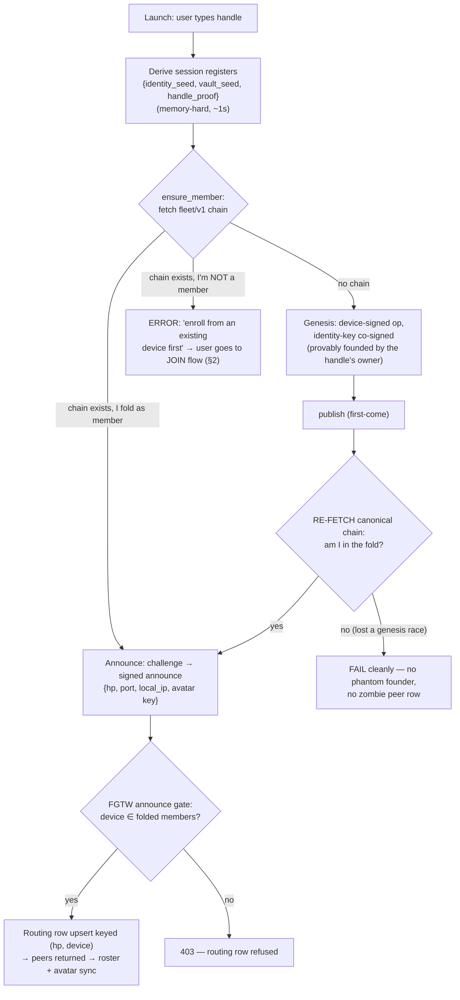
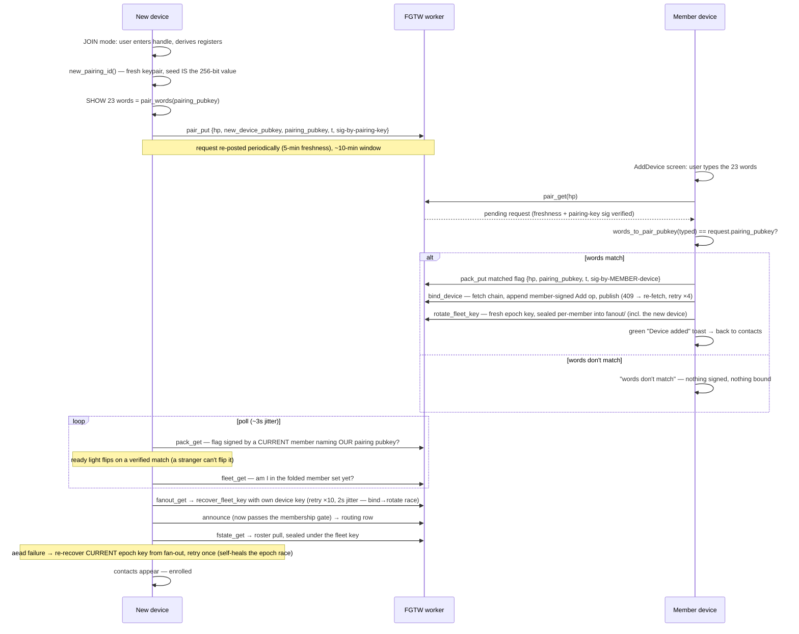
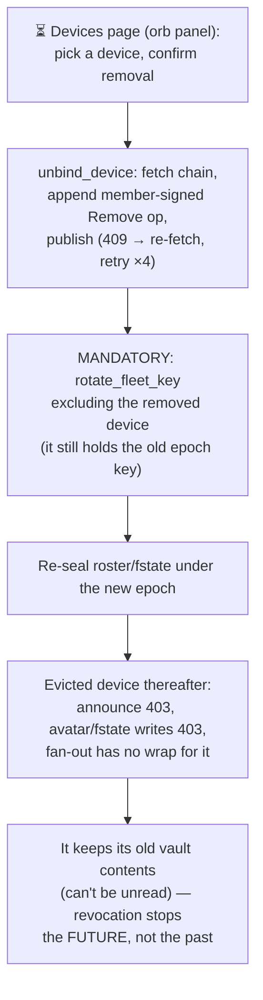

# Device lifecycle — attest, add, remove, modify

Flowcharts for the whole device lifecycle as implemented (photon `e0bb39f` / fgtw `c068a1d`), with the unbuilt pieces marked ⏳.
Companion to [keyring.md](keyring.md) (the membership-chain design) — this file is the *process* view: what each actor does, in what order, and where it can fail.

**UI note (decided 2026-07-03):** the orb is the entry to a settings/about/help panel; device management is a separate *page inside that panel*, not the orb's direct action.
The current orb→AddDevice and orb→JOIN-mode wiring is interim scaffolding until the panel exists. ⏳

**Fleet-size invariant:** every flow below must hold for a fleet of ANY size (design for 12+, no "the other device" shortcuts).
Egg-lists, fan-out re-key, and braid-in are all per-sibling operations.

## Actors and storage

| Actor | Holds |
|---|---|
| New device | its fingerprint-deterministic device keypair; nothing else until enrolled |
| Member device | device keypair, fleet key (current epoch), vault |
| FGTW worker | verifies + stores; never holds a secret |

R2 slots (all under one identity's `handle_proof`): `fleet/v1/` (membership chain, the authority), `pair/req/` (pairing request inbox), `pair/ack/` (matched flag), `fanout/` + `fanout_ep/` (per-member sealed fleet-key wraps + epoch), `fstate/` + `fstate_ts/` (fleet-key-sealed roster), `peers.vsf` (routing rows, gated on membership).

## 1. Attest (first run / resume)

Notes:
- The resume path is the same chart: a wiped-and-reinstalled device re-derives the SAME device key from its fingerprint, folds as an existing member, and sails thru with no ceremony. That is a feature (resume), and it is why a stale surviving chain reads as "pairing bypassed" — the octopus nuke deletes by whole-bucket enumeration precisely so test resets can't leave a chain behind.
- Residual (accepted for now): FGTW cannot cheaply VERIFY handle ownership, so a squatter can first-come-genesis a fake identity binding; peers who know the handle detect it via `genesis_identity_matches`. True server-verifiable ownership is the deferred ZK/accumulator egg.
- ⏳ The `fleet/v1` slot has no compare-and-set: two devices racing a fresh handle's genesis inside the load→check→put window can both "succeed" with last-write-wins. The client-side re-fetch shrinks the window; the real fix is an R2 conditional put or a Durable Object serialising fleet ops.

## 2. Device ADD (pairing)

The words travel new→old: the NEW device shows them, the OLD (member) device types them.
The 23 voca words encode a fresh **pairing public key** — not a bearer secret: the request is signed by the pairing PRIVATE key, so a shoulder-surfer who reads the words can find the request but can never forge a rival one for their own device.
The decision (the bind) happens only on the already-trusted member device; correct words ARE the confirmation (auto-bind, no second tap; orb is purely cancel).

⏳ Still open after enrollment: **braid-in**. The new device has routing + the fleet key but zero braid history; each existing friendship needs a per-sibling strand establishment (fresh CLUTCH per friendship from the new device), N-wide by design — never "re-CLUTCH with the one other device".

### 2.1 NFC variant (designed 2026-07-04; unbuilt ⏳)

The same ceremony with ONE leg swapped: the tap carries the pairing pubkey old←new instead of the human typing 23 words. Everything else — the pairing-key-signed request, the member-signed matched flag, the bind, the rotate, the fan-out recovery — is the machinery above, unchanged.

**The verification model: an end-to-end authenticated ack, not channel authentication.** The old device acks whatever pubkey it received (matched flag, member-signed, naming that key). The new device's ready light flips green ONLY on a verified flag naming ITS OWN pairing pubkey (`poll_pair_matched` — a stranger can't flip it). So the human never compares fingerprints across screens; they check the one bit humans check reflexively: *did MY device light up after MY tap*. Attacker taps first → the old device acked the attacker's key → YOUR device stays red "unenrolled" → you don't confirm. Red means the old device is holding someone else's key.

**Corollary — the channel needs ZERO trust.** The tap delivers a public value; the confirmation arrives over the authenticated network path. A fully hostile NFC relay changes nothing: relaying the real key enrolls the real device, substituting a key turns the real device's light red. Nothing secret crosses the tap, so there is nothing for proximity to steal and nothing for it to forge.

**And the waiting device isn't naked.** In JOIN mode it is pre-aimed: it holds its pairing PRIVATE key, it is bound to ONE handle's fleet, and it proceeds only on a member-signed flag naming its own pubkey followed by actual folded-chain membership. An attacker's tap leaves it inert and un-redirectable — everything it has exposed (its request) is public and self-signed; everything it will accept is membership-gated. It just keeps waiting for you to let it in.

Two implementation disciplines (the entire remaining attack surface):
1. **Ack ≠ authorize, one candidate at a time.** The tap gets a key acked; only a human press on the old device signs the ADD — and the press is BOUND to the acked candidate. A second tap landing between green light and press (the TOCTOU squeeze) REPLACES the pending candidate, re-acks, and invalidates the armed confirm, so the signed key is always the one whose ack is currently live — and the displaced device's light flipping red is the alarm.
2. **Pending ≠ enrolled.** Green = acked; enrolled = this device folds from the chain (the existing membership poll). The user waits for *enrolled*; a rogue signing while your device sits at red/pending is loud, and removal + rotate-on-remove is the built backstop.

**Required screen copy — the human step IS protocol, so the screens must teach it.** One word family end to end (*unenrolled → pending → enroll → enrolled*), so nothing on one screen needs translating to the other:

The canonical walk: **virgin** (fresh install) → **enter handle** (device aims itself at the fleet, posts its signed request) → red **"Unenrolled — tap your other device"** → tap → green **"Pending — confirm on your other device"** → old device's **Enroll** button (the signing press) → **"Enrolled"** (device folds from the chain, recovers the fleet key, attests, lands on contacts).

- The colour flip is the verification; the words say what to do at each state.
- Old device, confirm screen: the button is **Enroll**, and the line above it is load-bearing: **"Confirm only when your new device shows green 'Pending'."** Without it a user taps, sees a button, and presses; with it, a red far screen stops the press cold.
- Enroll-press → Enrolled is not instant (chain publish, membership poll, fan-out recovery — a second or two of green after the press). That gap is the pending ≠ enrolled discipline made visible; the screen should show progress, not freeze.

Scope: NFC is a phone↔phone accelerator (laptops rarely have the radio); the 23 words remain the universal path. Same fleet ADD underneath either way.

## 3. Device REMOVE

The chain primitive is built and server-verified (member-signed `Remove` op, same fold rules); the management UI is unbuilt. ⏳

Rules:
- Revocation sticks because FGTW gates every write and announce on the folded chain — the network refuses the device, not the device forgetting.
- Rotate-on-remove is not optional: skipping it leaves the evicted device able to open every future roster/fstate blob.
- Remote removal of a LOST device is the point — any remaining member device can sign the Remove (current auth rule: any single member may Add and Remove).

## 4. Device MODIFY ⏳ (future, patent-specified)

Nothing implemented yet; the chain's op format is where these land when they do:

- **Tiered authority** (`devauthority`): asserting-only devices vs enroll/revoke-privileged ones — a kiosk can act as you without being able to grow the fleet.
- **Assertion alerts** (`assertionalert`): every assertion broadcast loudly to the whole fleet by default.
- **Custodian threshold** (custodes): K-of-N humans recover when the lost device WAS the management-privileged one — meets the keyring only at re-genesis.
- Device labels/renames — cosmetic, fleet-state not chain ops.

## Cross-cutting invariants

- **Any fleet size.** Every loop above is per-member/per-sibling; nothing may assume N=2.
- **Reply routing.** When a message arrives from a friend, the device it came from is presumed active — primary TX target for replies; the rest of their fleet gets every message as fast as routable. Needs the per-device address table (beacons carry `ke` since `e0bb39f`) and last-RX-device tracking, both ⏳.
- **The chain is the sole authority.** Announce rows, avatar writes, fstate writes, fan-out wraps — all gated on the folded member set; `peers.vsf` is just a routing table.
- **One durable log.** Every step above logs to `photon.log.vsf` (see `photonlog`), pullable from any device for bug reports.
