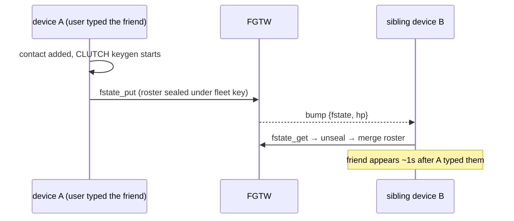

# Fleet sync — the bump architecture

How a fleet of N devices stays one identity: every state change is a **bump** (a tiny push frame naming *what* changed and *where the sauce is*), and siblings fetch the delta from the best source.
The bump is a doorbell, not the package.

Companion to [device-lifecycle.md](device-lifecycle.md) (how devices join/leave the fleet) and [keyring.md](keyring.md) (the membership chain).
Status markers: ✅ shipped · 🔶 partial · ⏳ unbuilt.

**Doctrine this design answers to:**
- All push, no poll cadences — the only timers are ones an external protocol forces (slot freshness, reconnect backoff, NAT keepalive).
- Vaults byte-identical across the fleet except the device crypt key; the fleet is ONE logical identity.
- Every message reaches every sibling as fast as routable — which requires every sibling to be able to DECRYPT every message.
- FGTW is a dumb rendezvous: it never sees plaintext and never carries bulk. Content flows device-to-device wherever both ends are alive.

## 1. The bump

A typed VSF frame broadcast thru the hub (today: the `CAPSULE_HUB` Durable Object behind `wss://fgtw.org/ws`).

```
section pair_evt {
    k:  kind        (VsfType::a — ASCII; the worker's vsf build has no text feature, x panics)
    hp: handle_proof (whose fleet this concerns)
    dk: src device pubkey   ⏳ (which sibling has the fresh state)
    ip: src addr            ⏳ (where to fetch it P2P; port implied = PHOTON_PORT)
}
```

Kinds:

| kind | meaning | shipped |
|---|---|---|
| `matched` | a member verified the pairing words | ✅ |
| `fleet` | the membership chain extended | ✅ |
| `fstate` | the fleet-sealed shared state changed (roster today) | ✅ |
| `friendship` | a sibling completed a CLUTCH / friendship state changed | ⏳ |
| `stream` | new conversation rows exist for some friendship | ⏳ |

Properties:
- **Best-effort.** A lost bump costs latency, never correctness — the durable slots + the on-launch catch-up query are the guarantee.
- **Public.** The hub broadcasts to every subscriber; subscribers filter by `hp`. This leaks "identity X's fleet is active" plus a device addr — both already public in `peers.vsf` under the OPEN-phonebook doctrine. The *content* reference is just a pointer; the content itself is sealed or P2P.
- **Tiny.** ~90–160 bytes. Cloudflare carries doorbells, not data.

## 2. The three sauces

What a sibling fetches on a bump, from where, sealed how:

| state | source | fallback | sealed under | size |
|---|---|---|---|---|
| membership chain | FGTW `fleet_get` (public, verifiable by anyone) | — | nothing (it IS the public provenance) | ~100s of bytes |
| roster + friendship state | P2P from `src` ⏳ | FGTW `fstate` slot ✅ | fleet key (epoch'd via `fanout/`) | KBs |
| conversation streams | P2P from `src` (rārangi rows over PT) ⏳ | periodic sealed snapshot in a fleet slot ⏳ | fleet key | unbounded |

The chain comes from FGTW because it is public and tiny and anyone must be able to verify it.
Everything else prefers device-to-device: FGTW's slots exist so a sibling that was asleep for a week still converges, not as the primary path.

## 3. The diff protocol — heads, not versions

The bump carries no version numbers.
Each sibling already knows its own heads, and every store is monotonic, so "what am I missing" is one comparison per store:

- **chain**: my folded op count vs the fetched chain (forward-extension-only, so longer = newer).
- **fan-out**: my cached epoch vs `fanout_ep`.
- **fstate**: my last-merged timestamp vs `fstate_ts`.
- **streams**: my per-friendship monotonic row counter (rārangi pk) vs the source's; fetch rows > mine.

Re-fetch after a duplicate or stale bump is idempotent by construction — you ask for "everything after my head" and get nothing.
On launch (the one legitimate pull): compare all heads once, fetch deltas, then ride bumps.

## 4. Flows

### 4.1 Add-friend propagates (roster) — ✅ shipped 2026-07-03, minus the P2P fetch



### 4.2 One CLUTCH, shared with the fleet — ⏳ the friendship kind

Exactly ONE device completes the ceremony; the fleet inherits the result.
Election is by intent, with no coordination protocol:
- **Outbound**: the device where the human pressed *add* runs the ceremony — the finger is the election.
- **Inbound**: the friend sends their offer to the one device they consider active (reply-to-active-device rule); whichever device RECEIVES the offer completes it.

```mermaid
sequenceDiagram
    participant A as device A (completed CLUTCH)
    participant W as FGTW
    participant B as sibling device B
    A->>A: CLUTCH Complete with friend F
    A->>W: friendship state sealed into the fleet slot (chain, braid state, conversation token)
    A->>W: bump {friendship, hp, src=A}
    W-->>B: bump
    B->>A: P2P fetch (preferred) — or fstate fallback if A went dark
    B->>B: adopt friendship; DISCARD own parked offer toward F
    Note over B: "a sibling already braided this" — B's pending ceremony is garbage-collected
```

### 4.3 Conversation streams — ⏳ the stream kind (this IS the device-sync phase, arriving early)

Every ciphertext — received or sent — must reach every sibling, because ratchet advance on receive is a pure function: same ciphertext in, same state out.

```mermaid
sequenceDiagram
    participant F as friend (their active device)
    participant A as our active device
    participant B as our sibling
    F->>A: message ciphertext (braid)
    A->>A: decrypt, advance ratchet, persist row N
    A->>B: fan ciphertext P2P (raw row, still braid-sealed)
    B->>B: advance own ratchet copy identically — byte-identical vaults
    Note over A,B: if B unreachable: bump {stream, hp, src=A} rides the hub; B fetches rows > its counter when it wakes
```

TX mirrors RX: the sending device advances and fans its own outgoing ciphertext to siblings the same way.

### 4.4 Wake-up catch-up — the one pull

A device that was off compares all four heads (chain / fanout epoch / fstate ts / per-friendship row counters), fetches the deltas (P2P from any online sibling, slots as fallback), then subscribes to bumps.
No periodic sync loop exists or is needed.

## 5. The fork case — concurrent TX from two siblings

Two of our devices sending simultaneously from the same ratchet position is the one genuinely hard case.
This is where the braid's novelty claim does real work: each message **explicitly references which strands it consumed**, so a concurrent send is not silent key-reuse (fatal in a linear double ratchet) — it is a visible, nameable fork the referencing structure can represent and merge.
A classic Signal-style ratchet cannot do fleet-shared state safely; the braid arguably can *by construction*.
Interim rule until the merge semantics are specified: concurrent TX is unlikely (a human types on one device at a time), detectable (strand references), and recoverable (re-braid from the last common strand).
This section needs the crypto review pass promised in the braid novelty notes.

## 6. Prerequisite on the FRIEND's side — fold the fleet

None of the above helps until a friend's device recognises ALL current members of our chain:
- A contact is an IDENTITY, not a device: resolve the contact's membership chain (`fleet_get` by handle_proof — public), fold it, and honour pings/offers/messages from ANY current member pubkey. ⏳
- Revocation comes free: a removed device stops folding and goes silent.
- Their contact row grows a per-device address table (the pt_disc beacon already carries `ke` for exactly this) with the last-RX device marked active — the reply-to-active-device rule's state.
- Observed live 2026-07-03: friend ponged the desktop (known pubkey) and silently dropped the macbook (unknown sibling) — the parked-offer stall this section fixes.

## 7. Implementation order

1. **Bump carries `src` (dk + ip)** — extend `broadcast_pair_event` + `parse_pair_event`; callers pass the posting device. Small.
2. **Friend-side fold-and-honour (§6)** — self-contained, unsticks second-device friendships immediately once friends update.
3. **`friendship` kind (§4.2)** — seal friendship state into the fleet slot on Complete; siblings adopt + discard parked ceremonies.
4. **`stream` kind + P2P row fetch (§4.3)** — rides PT; the vault-roadmap device-sync phase begins here.
5. **Snapshot slot for long-offline catch-up** — last, once streams flow.

## 8. The decentralization endgame

This shape survives the peers-are-FGTW transition untouched: the bump stops being a Cloudflare hub frame and becomes peer gossip; the slots stop being R2 objects and become peer-held replicas; every fetch is already P2P-first.
Nothing above assumes fgtw.org exists beyond "somewhere a doorbell rings and a fallback blob sits" — both roles any peer can serve.
