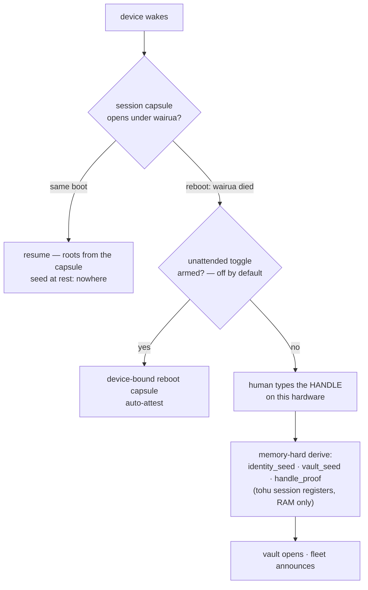
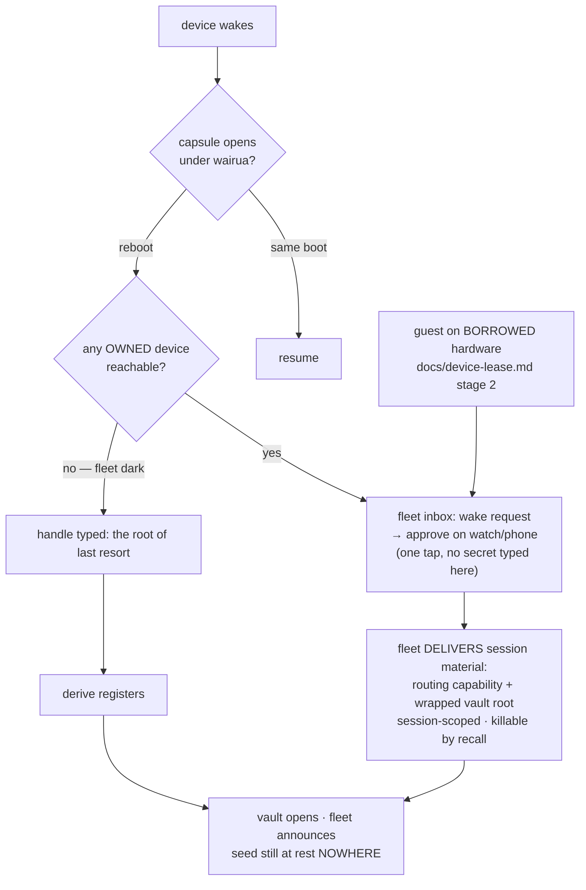

# Key custody — who vouches for a waking device

Design sketch 2026-09-04 (Nick, riffing off docs/device-lease.md): the lease's delegated session isn't a guest-only trick — it's the general shape. The identity seed and decryption roots should be AT REST NOWHERE; day to day, the FLEET delivers session material to a waking device, and the typed handle becomes the root of last resort instead of the daily ritual.

## The voucher spectrum

Every wake answers one question — who vouches for this device right now?

| voucher | lifetime | what it proves | cost to the human |
|---|---|---|---|
| **wairua** (per-boot secret) | until power interruption | same boot, same session — nothing left the rail | zero (seamless resume) |
| **fleet** (an owned device approves) | until recall/lockout | the human is reachable on hardware they already hold | one tap elsewhere |
| **handle** (typed) | the root itself | the human knows the name that IS the key (seed = BLAKE3(handle)) | typing a secret on THIS hardware |

Falling down the ladder is the design: boot vouches until reboot; the fleet vouches when any owned device is live; the handle is needed only when nothing else exists — first device, total loss, all-offline. Today the ladder has a hole: reboot skips straight past the fleet to the handle.

## Today (shipped + spec'd)

The invariant already held everywhere: nothing durable stores the seed; the capsule stores roots only under a key that dies with the power rail. The cost: every reboot spends a handle entry ON the waking device — the one place a keylogger would sit.

## Target (the ladder completed)

The guest session and the owned-device wake become the SAME approval flow — the lease's stage-2 machinery, pointed at your own hardware. Lockout unifies too: a locked-out device is exactly one the fleet refuses to vouch for; recall of a delivered session is the same verb for guests and for your own drawer phone.

## Invariants (non-negotiable)

1. **The identity seed itself never crosses a wire and never rests.** What the fleet delivers is session material: routing capability, streamed history, and a WRAPPED vault root — killable, session-scoped, useless off-device. (The wrapping design rides the fleet-key redesign's ira-wrap work — docs/fleet-key.md.)
2. **The handle is typed only at the root of the ladder** — first device, total loss, fleet dark. Every rung above it exists to keep the handle OFF keyboards, especially borrowed ones.
3. **No timers.** Wairua dies at the power rail; fleet vouching dies at the recall/lockout edge; nothing expires by clock.
4. **Approval is an owned-device edge** — the fleet-inbox bind-attempt alert, the same consent surface the lease and pairing v2 use.

## Open questions

- Exactly what the wrapped vault root is: the ira-wrap from the fleet-key redesign is the natural candidate, but that spec is still under Nick's review — this doc must not front-run it.
- The all-devices-rebooted-simultaneously fleet: everyone's wairua died, nobody can vouch — one device takes the handle entry and re-seeds the ladder. Fine, but the UX should say WHY ("your other devices are dark").
- Whether the unattended reboot-capsule toggle survives this design or is subsumed by it (a fleet-vouched wake is strictly better where a sibling is reachable; the capsule keeps the single-device unattended case).
