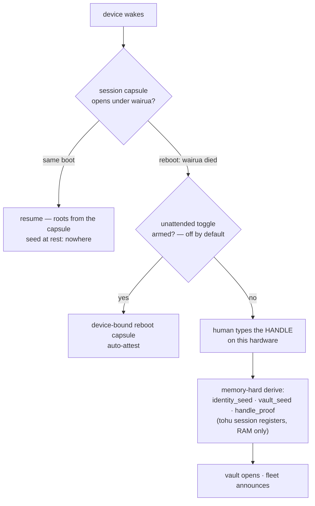
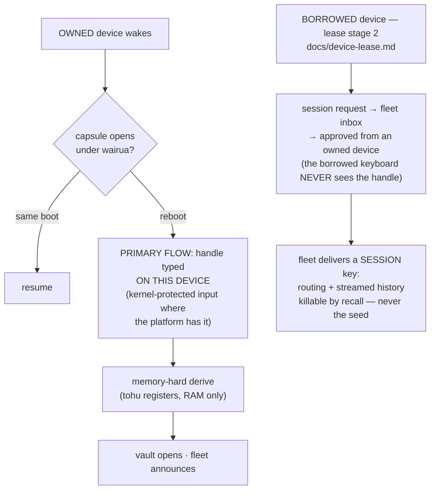

# Key custody — who vouches for a waking device

Design 2026-09-04, settled after two revisions (both Nick's): **the primary flow for OWNED hardware is a direct handle entry on the device itself.** The delegated session is the LEASE's mechanism — it exists because borrowed hardware must never see the handle — and it does not generalize into a wake path for your own devices. The identity seed and decryption roots stay at rest nowhere; what varies by rung is only who re-proves the human after the wairua dies.

## The voucher spectrum

Every wake answers one question — who vouches for this device right now?

| voucher | applies to | lifetime | what it proves |
|---|---|---|---|
| **wairua** (per-boot secret) | owned hardware, same boot | until power interruption | same boot, same session — nothing left the rail |
| **handle typed ON the device** | owned hardware — THE PRIMARY FLOW | the root itself | the human knows the name that IS the key (seed = BLAKE3(handle)) |
| **delegated session** (the lease's ONLY flow) | BORROWED hardware only | until recall | an owned device approved — the handle NEVER touches the borrowed keyboard (the typed-handle "household lease" was cut 2026-09-04: foreign hardware must never receive a handle, family included) |

**Two revisions, both Nick's, same day — kept as testimony:**
1. A tap-only fleet vouch was rejected: possession must never suffice (a stolen backpack — rebooted laptop + still-attested watch — would have authenticated).
2. The approver-typed variant for OWNED devices was rejected too: the drawer phone, the re-added laptop, the sold device under its new owner's handle — every owned-hardware wake takes a DIRECT handle entry on that device. The delegated session is not a convenience rung; it is the lease's necessity, scoped to hardware that must not see the handle because it is not yours.

Keylogging on the primary flow is a PLATFORM problem with a platform answer: ferros and Android can give the handle entry a kernel-protected input path; Windows and macOS cannot promise one — a hardening axis for the entry box, not a reason to move the entry off the device.

## Today (shipped + spec'd)

The invariant already held everywhere: nothing durable stores the seed; the capsule stores roots only under a key that dies with the power rail. The cost: every reboot spends a handle entry ON the waking device — the one place a keylogger would sit.

## Target

Owned and borrowed stay separate flows on purpose: the delegated session's whole justification is that the hardware is not yours to type on. Lockout/recall remain routing-layer verbs for both.

## Invariants (non-negotiable)

1. **The identity seed itself never crosses a wire and never rests.** The lease's delegated session delivers session material only — routing capability + streamed history, killable by recall — never the seed and never a vault root for hardware that isn't yours.
2. **Owned hardware authenticates by direct handle entry on that device.** No proxy entry, no vouch-by-sibling. Possession alone authenticates nothing, ever.
3. **No timers.** Wairua dies at the power rail; a delegated session dies at the recall edge; nothing expires by clock.
4. **The borrowed keyboard never sees the handle** — the lease exists precisely because that entry is banned there; approval + knowledge live on an owned device.

## Open questions

- Kernel-protected handle entry: the ferros path is ours to build; the Android secure-input shape needs research; Windows/macOS may simply stay honest about the gap.
- The unattended reboot-capsule toggle stays as shipped — the one deliberate possession-only surface, off by default, armed by handle entry, single-device scope.
- What the guest session streams and caches on borrowed hardware (viewport depth) — sized with the lease stage-2 build.
